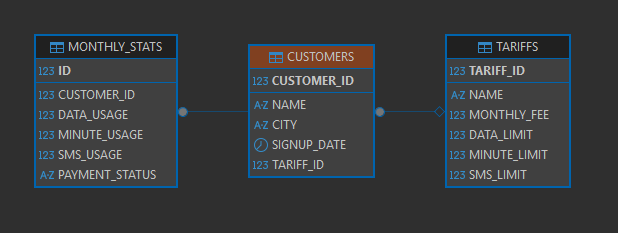

# i2i Systems SQL Case Study 

Bu proje, i2i Systems staj başvuru süreci kapsamında hazırlanmış olup, bir telekomünikasyon veritabanı şeması üzerinde gerçekleştirilen veri analizi ve SQL sorgulama görevlerini içermektedir.

## 🛠 Kullanılan Teknolojiler
* **Veritabanı:** Oracle Database Express Edition (Oracle XE)
* **Altyapı:** Docker & Docker Compose
* **Veritabanı İstemcisi:** DBeaver
* **Dil:** SQL (PL/SQL)

## 📊 Veritabanı Şeması (ER Diyagramı)


## 📂 Proje Yapısı (Dosyalar)
* `docker-compose.yml`: Oracle XE veritabanı ortamını Docker üzerinde ayağa kaldırır.
* `/init-scripts/TABLE_CREATION_SCRIPTS.sql`: Tablo oluşturma ve Foreign Key kısıtlamalarını içeren DDL komutlarıdır. Konteyner başlatıldığında otomatik olarak çalışacak şekilde ayarlanmıştır.
* `SOLUTIONS.sql`: İstenen 6 fonksiyonel gereksinimin SQL sorgularını ve her bir yaklaşımın detaylı açıklamalarını içerir.
* `/data`: Projede kullanılan ham CSV veri setlerini (`CUSTOMERS.csv`, `TARIFFS.csv`, `MONTHLY_STATS.csv`) barındırır.

##  Proje Nasıl Çalıştırılır 
Bu proje, sistemin eksiksiz olarak tek tuşla ayağa kaldırılabilmesi ve **Otomatik Veritabanı Kurulumu (Automated Seeding)** için bir `docker-compose.yml` dosyası içerir.

### Ön Koşullar
* Bilgisayarınızda Docker ve Docker Compose yüklü olmalıdır.

### Adım Adım Çalıştırma
1. Bu repoyu bilgisayarınıza klonlayın.
2. Terminalinizi açın ve proje dizinine gidin.
3. Oracle XE veritabanını başlatmak için aşağıdaki komutu çalıştırın:
   ```bash
   docker-compose up -d
4. Otomatik Kurulum: /init-scripts klasöründeki TABLE_CREATION_SCRIPTS.sql dosyası, konteyner başlatılırken otomatik olarak çalışacaktır. Tabloları manuel olarak kurmanıza gerek yoktur!

5. DBeaver'ı açın ve localhost:1521 adresine bağlanın (Kullanıcı Adı: system, Şifre: oracle).

6. /data klasöründeki CSV dosyalarını DBeaver'ın içe aktarma (import) aracını kullanarak ilgili tablolara aktarın.

7. Analizleri ve sonuçları görmek için SOLUTIONS.sql içindeki sorguları çalıştırın.
